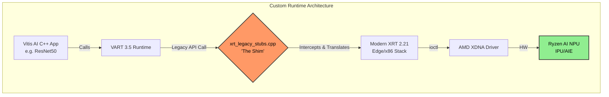

# Hi, I'm Noah Lee 👋

### 🛠 System Engineer | AI Hardware Enthusiast | NPU Pioneer

I specialize in bridging the gap between bleeding-edge Linux kernels and AI silicon. Recently, I've been focused on enabling native NPU acceleration for the **Ryzen AI (Strix/Phoenix)** series on unsupported Linux distributions.

---

### 🚀 R&D Highlights: Native Ryzen AI Enablement

#### 1. Native Vitis-AI 3.5 on Ubuntu 24.04 (Python)
I engineered a native (non-Docker) bridge for the **AMD Ryzen AI NPU** using the upstream **6.14-rc kernel**.
* **Technical Breakdown:** [✅ Native NPU Handshake Verified (Issue #319)](https://github.com/amd/RyzenAI-SW/issues/319#issuecomment-3707996096)
* **The Fix:** Rebuilt Python 3.12 bindings against native headers and mapped local library dependencies to resolve "NoneType" attribute errors in the XDNA driver.

#### 2. Custom VART C++ Runtime Port (C++ / Systems)
Ported the low-level Vitis AI Edge runtime to modern XRT 2.21 drivers, enabling native C++ application support.
* **The Problem:** API deprecation (`xclOpen`) in modern XRT breaks standard VART 3.5 builds.
* **The Engineering:** Implemented a custom C++ shim (`xrt_legacy_stubs.cpp`) and patched CMake for static linkage injection (`libxrt_coreutil.a`).
* **The Proof:** Successfully compiled and executed the `resnet50` C++ demo, verifying runtime initialization and hardware fingerprinting on the NPU.

---

### 🧠 Tech Stack & Tools
* **Languages:** Python (3.12+), C++, Bash
* **AI Frameworks:** Vitis-AI 3.5, ONNX Runtime, XIR/VART
* **Hardware/Drivers:** AMD XDNA, XRT (Xilinx Runtime), Ryzen AI 300 Series
* **Environment:** Ubuntu 24.04 (Noble), Kernel 6.14-rc, Git LFS Management

---

### 📈 GitHub Stats

---

### 🤝 Let's Connect
* **LinkedIn:** [Noah Lee](https://www.linkedin.com/in/noah-lee-aa128a3a0)
* **Discord:** `leeno7786`
* **Working on something similar?** Open an issue or hit me up for NPU/XDNA troubleshooting.
