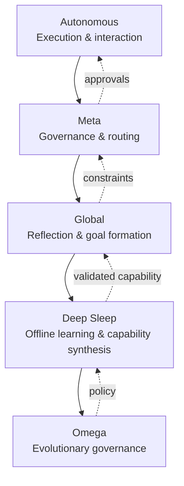

  

  
  
  
  

  <strong>An architecture for bounded autonomy, offline learning, and evolutionary safety.</strong> 
  Omega 3.0 is the evolved successor to Omega 2.5 — rebuilt around memory primacy, time-discipline, and reversible governance.

---

## Quick navigation
- [Featured](#featured)
- [Executive Summary](#executive-summary)
- [Design Principles](#design-principles)
- [Architecture](#architecture--five-layers)
- [Time as a Primitive](#time-as-a-primitive)
- [Offline Learning](#offline-learning)
- [Cost & Practicality](#cost--practicality)
- [Connect](#connect)

---

## Featured
- **Omega site (project hub):** https://github.com/leeno7786-coder/omega-site  
- **Ryzen AI on Linux enablement:** https://github.com/leeno7786-coder/ryzen-ai-linux-enablement  

---

## Executive Summary — AI built like infrastructure, not a product

Omega 3.0 is a **portable, memory-first autonomous cognitive system**. It is not an LLM wrapper, not a prompt‑chaining agent, and not a cloud service. It is a self-contained substrate in which:

- **Memory is primary**
- **Inference is replaceable**
- **Autonomy is bounded by structure (not prompts)**
- **Learning happens offline** in a controlled phase

The system runs locally on commodity hardware, persists across restarts and machines, and treats **time** as a first-class primitive. Evolutionary changes are **reversible**, **audited**, and applied only after long-horizon evaluation. A first live instance has been validated in continuous operation.

---

## Design Principles

| Principle | Commitment | Practical meaning |
|---|---|---|
| 1. Temporal discipline | Cognition runs on a clock | Reactivity is a tool, not the loop |
| 2. Memory primacy | Memory is the substrate | Inference serves memory, not vice‑versa |
| 3. Separation of cognition & execution | Split responsibilities | Thinking ≠ doing; permissions differ |
| 4. Offline learning | No inline self-change | Adaptation happens between sessions |
| 5. Evolution, not mutation | Reversible change | Long-horizon evaluation + rollback |

---

## Architecture — five layers

```mermaid
flowchart TB
  A[Autonomous<br/>Execution & interaction]
  B[Meta<br/>Governance & routing]
  C[Global<br/>Reflection & goal formation]
  D[Deep Sleep<br/>Offline learning & capability synthesis]
  E[Omega<br/>Evolutionary governance]

  %% primary vertical separation
  A --> B --> C --> D --> E

  %% architectural property annotations
  D -. validated capability .-> C
  C -. constraints .-> B
  B -. approvals .-> A
  E -. policy .-> D
```

### Layer permissions (what each layer may/may not do)

| Layer | May | May not |
|---|---|---|
| **Omega** (evolution) | Evaluate long-horizon trends, propose structural change, rollback, decline to act | Modify runtime behavior directly; override lower safety; self-modify without evidence |
| **Deep Sleep** (offline learning) | Consolidate memory, distill capability, validate tools in isolation | Run tools against live world; change behavior mid-session; expose unvalidated capability |
| **Global** (reflection) | Reflect across episodes, form/revise goals, surface tensions | Invoke tools; bypass governance; treat conclusions as ground truth |
| **Meta** (routing) | Route requests, enforce policy, stage/escalate, halt execution | Originate goals; mutate memory directly; grant new capabilities |
| **Autonomous** (execution) | Execute approved actions, converse, observe, record outcomes | Self-modify; bypass governance; act outside capability surface |

**Architectural property:** Capability flows upward only through validation. Governance flows downward only through policy. No layer can promote itself.

---

## Time as a primitive

- **Phase-clocked cognition:** deterministic cadence driven by composite urgency  
- **Wall-clock anchoring:** every memory/decision/outcome has time provenance  
- **Inference pause ≠ time pause:** elapsed real time tracked independently  
- **Determinism across restarts:** coherent continuation, not a “fresh session”

---

## Offline Learning

**Signals inform reflection; they never directly control behavior.**

Advisory signals:
- **Outcome signal** (episode coherence)
- **Learning gate** (when plasticity is allowed)
- **Reliability signal** (capability consistency across episodes)

Promotion rule:
- reasoning becomes reusable capability **only after offline validation**  
- new capability is exposed to active layers only after passing validation  
- failures are recorded, not silently discarded

---

## Cost & Practicality

- Local, commodity hardware (no cluster)
- Inference-agnostic (swap models without redesign)
- Portable across machines
- Approx. **~£400 / ~$500** unit cost

---

## Connect

  
  
  
  
  
  

  

